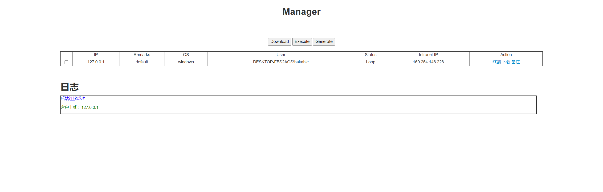

# Manage
一款HMP的b/s全平台通用的客户管理工具

## todo

- 分组
- sleep间隔修改
- 分组定时任务
- IP黑名单

## 注意

对客户端无过滤（懒得写），有潜在的XSS风险。

## 关于反代

修改`app/config/config.py`下的`CONFIG["base"]["cdn"] = False`改为True

之后把`CONFIG["base"]["source_ip_tag"] = "X-Real-Ip"`修改为反代返回给你正确IP的tag

# 关于Release

其自行编译Client使用交叉编译放置于`Server/bin`下面

# 如何编译
## Server
需要以下依赖：

	- flask

## Client

 - 把此项目clone到你的GOPATH
 - mv $GOPATH/9bie/manager/Client
 - go build

